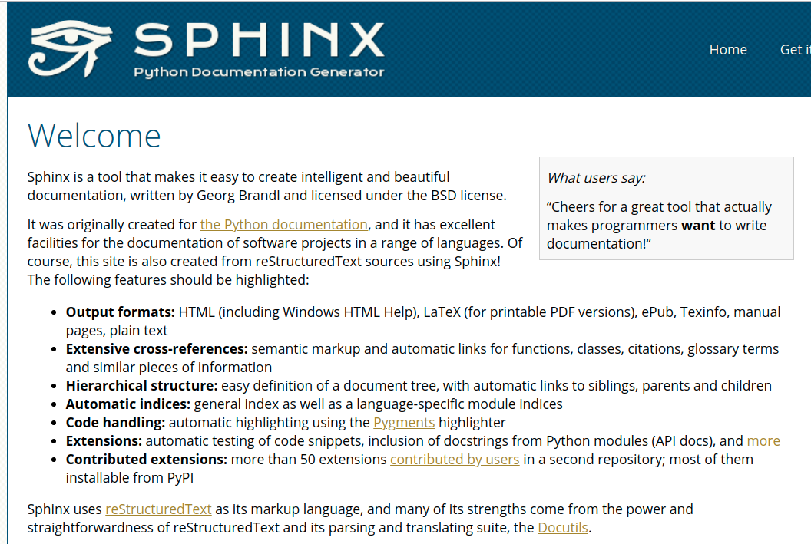
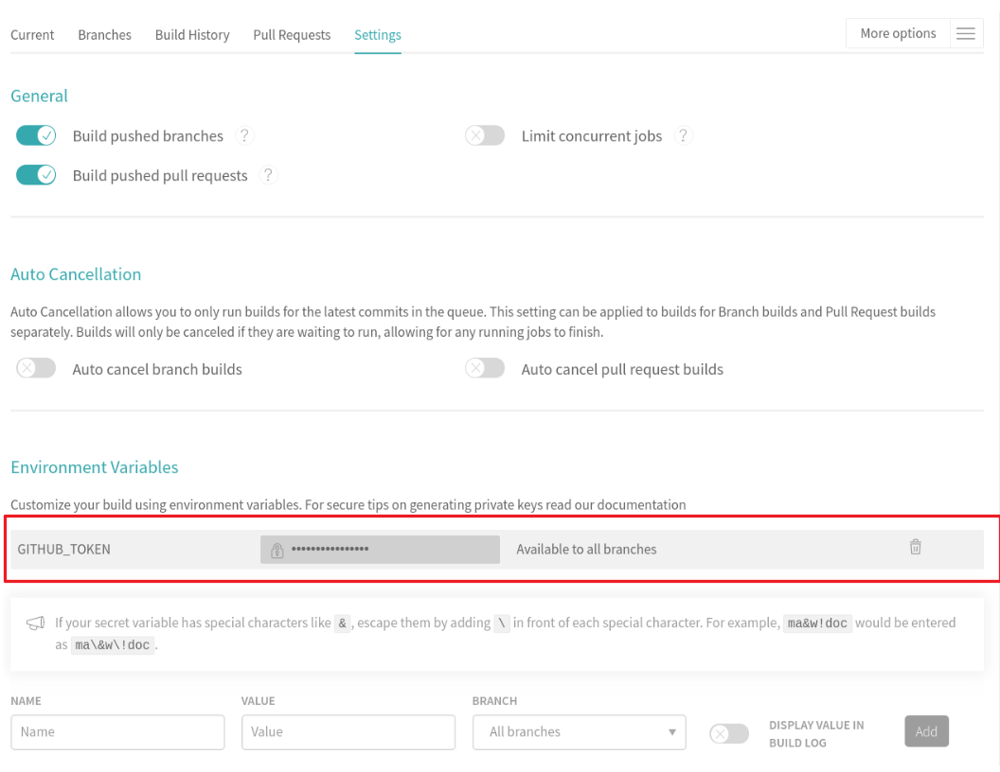

# Technical documentation system: considerations

- Not the same as writing a blog article

- Writing

    - Focus on contents and structures, strict and fixed formatting

    - Principle of separation: contents vs. layout

- Review

    - easy to see changes, revert, comment, collaborate etc

- Other considerations

    - Subject experts are not necessarily web developers

    - Multiple formats generated from the same source (e.g. web pages and pdf report/manual)


# What is Sphinx


- Sphinx converts reStructuredText files into HTML websites and PDF, EPub, Texinfo and man.

- reStructuredText (RST, ReST, or reST) is a file format for textual data for technical documentation.
    - a more powerful markdown without diverging flavors




# Advantages of using Sphinx

- Based on text files (close to plain text)

  - Use one's favoriate editor/local environment for writing
  - Easy to track changes using version control
  - Standard git pull (or merge) request review process
  - Easy to programmatically manipulate the text files, if needed
  - The entire workflow is open-source based, no vendor lock-in

- Generate static HTML pages 

  - No security concerns
  - No need to maintain WordPress that often "automatically" breaks
  - Can use free hosting services (github, gitlab, read the docs, etc.) if desired


# Sphinx demo

- view the source

    - [`https://github.com/schuang/sphinx-tutorial`](https://github.com/schuang/sphinx-tutorial)

- view the site

    - [`https://schuang.github.io/sphinx-tutorial`](https://schuang.github.io/sphinx-tutorial)


# Using Sphinx with CI: the big picture


# Continuous integration/deployment (CI/CD)

- A software engineering technique to integrate early and often to avoid "integration hell"

- Best practices:

    - Automate the build
    
    - Commit changes to repository regularly
    
    - Every commit is built and tested


# Travis CI

- Travis CI is a hosted contiguous integration service

- Integration with GitHub

- Free for open-source projects, paid plans for private repositories

- Web site: https://travis-ci.com/

There are also [several other popular CI systems](https://en.wikipedia.org/wiki/Comparison_of_continuous_integration_software) with a variety of build systems (C, C++, Python, PHP, etc.)


# Enabling Travis CI on a Github repository

- Create an access token in github.com
    
- Past the access token into Travis CI to enable access to Github

    - e.g. `$GITHUB_TOKEN`

    - Use it in `.travis.yml`

- Other CI/CDs have a similar procedure, e.g. `gitlab.com`


# github.com personal access token


# travis-ci.com environment variable




# YAML to control the CI process {.allowframebreaks}

```bash
$ cat .travis.yml
```

```yaml
language: python
branches:
  only:
  - master
python:
- '3.6'
install:
- pip install -U pip
- pip install -r requirements.txt
script:
- make html
deploy:
  provider: pages
  skip_cleanup: true
  github_token: $GITHUB_TOKEN
  local_dir: build/html
  on:
    branch: master
```


# pip-install additional packages

```bash
$ cat requirements.txt 
```

```
sphinx
sphinx_rtd_theme
recommonmark
```

# Travis CI jobs


# Useful Sphinx settings in `conf.py`

To support Github pages:

```python
extensions = [ 'sphinx.ext.mathjax',
               'sphinx.ext.githubpages' ]
```

To also support markdown source files:

```python
source_suffix = { '.rst': 'restructuredtext', 
                  '.md' : 'markdown' }
```


# Travis CI demo

What to look:

- See the github repository and travis-ci.com

- Commit to github triggering Travis CI build job

- Watch the "job log" in real time

- Build status badge


# gitlab pages pipeline

- similar to Travis CI
- use `.gitlab-ci.yml` (different syntax than `.travis.yml`)
- Can use arbitrary docker image from docker hub
- CI is ingegrated in gitlab, so no need to create the access token
- use `/public`

# 

```bash
$ cat .gitlab-ci.yml 
```

```yaml
image: python:3.6

pages:
  script:
    - pip install -U pip
    - pip install -r requirements.txt
    - make html
    - mv build/html/ public/
  artifacts:
    paths:
      - public
  only:
    - master
```


# gitlab pipeline jobs 


# Summary   {.allowframebreaks}

- Sphinx is a mature and powerful documentation generator

    - Designed for technical documentation

    - Used by many high-profile projects
    
    - Can easily include images, math, and code listing in style
    
    - Static web pages are light-weight, robust, and have no security issues
    

- Single source, multiple output formats

    - Separation of contents and detailed formatting
    
    - text files in ReST or markdown formats
    
    - Standard git-based workflow (pull/merge request etc.)
    
    - Customizable outputs in HTML, pdf, epub, etc.

    
- Contiguous Integration (CI) automate rebuild when there is a change

    - Travis CI builds from Github sources, place HTML on Github pages
    
    - Total control of the documentation production process, including themes
    
    - CI can be applied to other actions (by essentially arbrary scripts)
    
- Can use hosting service like "read the docs", but may not have full format control


